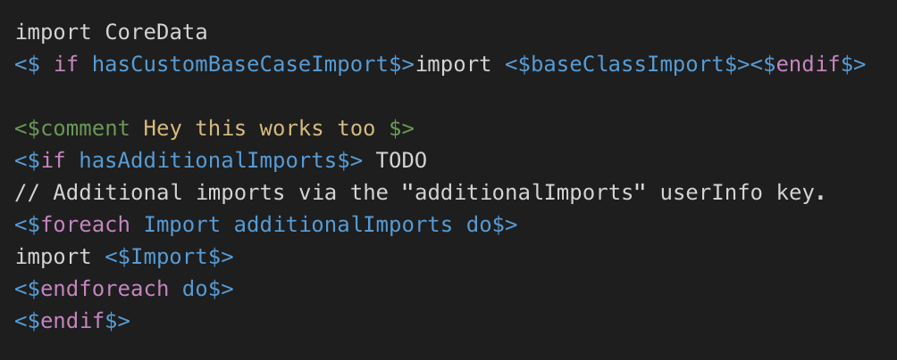

# `mogenerator` related resources

## For template editors

If you're editing `mogenerator` template files with Visual Studio Code, you can add syntax highlighting support for `.motemplate` files like [the ones included with `mogenerator`](../templates).

To use syntax highlighting, copy the `mogenerator-template-vscode` directory into `~/.vscode/extensions/` on your Mac, and relaunch Visual Studio Code.
